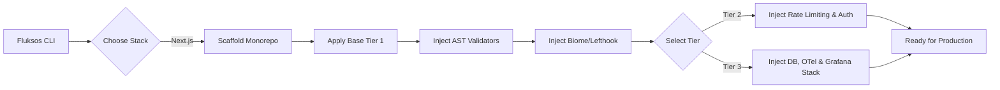

<div align="center">

<pre style="font-family: monospace; display: inline-block; text-align: left; color: #10b981; font-weight: bold;">
███████╗██╗     ██╗   ██╗██╗  ██╗███████╗ ██████╗ ███████╗
██╔════╝██║     ██║   ██║██║ ██╔╝██╔════╝██╔═══██╗██╔════╝
█████╗  ██║     ██║   ██║█████╔╝ ███████╗██║   ██║███████╗
██╔══╝  ██║     ██║   ██║██╔═██╗ ╚════██║██║   ██║╚════██║
██║     ███████╗╚██████╔╝██║  ██╗███████║╚██████╔╝███████║
╚═╝     ╚══════╝ ╚═════╝ ╚═╝  ╚═╝╚══════╝ ╚═════╝ ╚══════╝
</pre>

**The Enterprise Scaffolding & Validation Engine**

*Deterministic, opinionated scaffolds for production-grade applications. Zero config, 100% governance.*

<br/>

[](https://www.npmjs.com/package/fluksos)
[](https://github.com/pasqualinigui/fluksos/blob/main/LICENSE)
[](.github/CODE_OF_CONDUCT.md)
[](https://nodejs.org/)
[](https://pnpm.io/)
[](https://developer.mozilla.org/en-US/docs/Web/JavaScript)

🌍 *[Read in Portuguese (Leia em Português)](./README.pt-br.md)*

</div>

---

## ⚡ The Modern Ecosystem Problem

When a Senior Engineer starts a new project, they don't just run `create-react-app` and start coding. Setting up a truly scalable, production-ready environment is plagued by **Configuration Fatigue**.

It typically takes **3 to 5 working days** to manually glue together Turborepo, Biome, OpenTelemetry, Grafana dashboards, CI/CD pipelines, Docker architectures, and Git hooks. Worse still, as teams grow, enforcing architectural patterns (like preventing database calls from client components) becomes a code review nightmare.

### The Fluksos Solution

Fluksos is not just a boilerplate generator. It is a **Platform Engineering Governance Engine**. We took the exact infrastructure used by top-tier tech companies and compressed 5 days of setup into a **10-second CLI command**.

| Pain Point | The Fluksos Solution |
| :--- | :--- |
| 🐢 **Slow tooling & formatting** | Pre-configured with **Biome** and **Turbopack** for sub-millisecond linting and builds. |
| 💸 **Vendor lock-in observability** | Injects a full local **OpenTelemetry** stack (Tempo, Loki, Pyroscope, Grafana Faro). |
| 🛡️ **Sloppy PRs & bad code** | Built-in **AST Tribunal** parser that aggressively bans architectural violations at pre-commit. |
| 🤖 **Invisible to AI agents** | **AEO (AI Engine Optimization)** ready. Auto-generates `llms.txt` and semantic JSON-LD. |
| ⚠️ **Vulnerable endpoints** | Out-of-the-box **Upstash Redis Rate Limiting**, strict CSP headers, and Better Auth. |

---

## ⚙️ How The Engine Works

Fluksos uses a deterministic scaffolding pipeline. When you run the CLI, it evaluates your environment, creates a monorepo, applies strict tier-based templates, and binds everything with Git hooks.



---

## 📦 Quick Start

Initialize a brand new Enterprise application in seconds.

```bash
# 1. Global install (Recommended)
npm install -g fluksos

# 2. Explore available stacks
fluksos --help

# 3. Generate a Tier-3 Enterprise Project
fluksos init nextjs my-app --tier 3
```

*(Note: We strongly recommend running the command in an empty directory or allowing it to create `my-app` for you.)*

---

## 🛡️ The AST Tribunal (Governance)

Fluksos ships with its own custom Abstract Syntax Tree (AST) parser that runs locally via `lefthook` on every commit. It enforces what code reviewers often miss. 

If a junior developer tries to import a database connection directly into a Server Component Page instead of using a proper Repository pattern, **the commit is blocked**. If they try to use `@ts-ignore` or the legacy `axios`, **the commit is blocked**. Fluksos guarantees that your team's code quality remains pristine.

[Read the AST Validator Documentation ➡️](./docs/VALIDATORS.md)

---

## 📚 The Technical Manual

Fluksos is a massive undertaking. We have segmented our deep-dive technical documentation into the `docs/` folder for maintainers, tech leads, and developers.

- 📖 **[Table of Contents](./docs/README.md)**: Explore the full technical manual.
- 🏗️ **[Architecture & Tiers](./docs/NEXTJS_STACK.md)**: Deep dive into the Turborepo layout, Docker DB Workflow, and Observability.
- 🔒 **[Security & Rate Limiting](./docs/SECURITY.md)**: Zero-Day security via CSP, HSTS, and Upstash.
- ⚡ **[Code Generators](./docs/GENERATORS.md)**: How to auto-generate Next.js Server Actions and Hono RPC Hooks.

---

## 🧑‍💻 For Contributors

Are you an open-source contributor looking to add a new stack (e.g., NestJS) or modify the core engine? Please read the internal manuals:

- [**AGENTS.md**](./AGENTS.md): The core mapping of the CLI dispatcher and strict rules for AI Coding Assistants working on this repo.
- [**Next.js Maintainer Guide**](./stacks/nextjs/README.md): The internal pipeline of `init_project.js` and template wiring.

---

<div align="center">
  Built with obsession for clean architecture. <br/>
  <a href="https://github.com/pasqualinigui">Follow the Creator</a>
</div>
