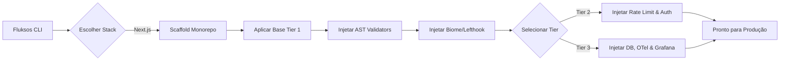

<div align="center">

<pre style="font-family: monospace; display: inline-block; text-align: left; color: #10b981; font-weight: bold;">
███████╗██╗     ██╗   ██╗██╗  ██╗███████╗ ██████╗ ███████╗
██╔════╝██║     ██║   ██║██║ ██╔╝██╔════╝██╔═══██╗██╔════╝
█████╗  ██║     ██║   ██║█████╔╝ ███████╗██║   ██║███████╗
██╔══╝  ██║     ██║   ██║██╔═██╗ ╚════██║██║   ██║╚════██║
██║     ███████╗╚██████╔╝██║  ██╗███████║╚██████╔╝███████║
╚═╝     ╚══════╝ ╚═════╝ ╚═╝  ╚═╝╚══════╝ ╚═════╝ ╚══════╝
</pre>

**A Engine Enterprise de Validação e Scaffolding**

*Scaffolds determinísticos e opinativos para aplicações nível de produção. Zero config, 100% de governança.*

<br/>

[](https://www.npmjs.com/package/fluksos)
[](https://github.com/pasqualinigui/fluksos/blob/main/LICENSE)
[](.github/CODE_OF_CONDUCT.md)
[](https://nodejs.org/)
[](https://pnpm.io/)
[](https://developer.mozilla.org/en-US/docs/Web/JavaScript)

🌍 *[Read in English (Leia em Inglês)](./README.md)*

</div>

---

## ⚡ O Problema do Ecossistema Atual

Quando um Engenheiro Sênior inicia um novo projeto, ele não roda simplesmente um `create-react-app` e começa a codar. Montar um ambiente verdadeiramente escalável e focado em produção é afetado pela **Fadiga de Configuração (Configuration Fatigue)**.

Geralmente, leva-se de **3 a 5 dias úteis** para conectar manualmente Turborepo, Biome, OpenTelemetry, Dashboards do Grafana, pipelines de CI/CD, arquiteturas Docker e hooks do Git. Pior ainda, à medida que a equipe cresce, impor padrões arquiteturais (como impedir que o banco de dados seja chamado diretamente pelo cliente) se torna um pesadelo nos Code Reviews.

### A Solução Fluksos

O Fluksos não é apenas um gerador de *boilerplate*. É uma **Engine de Governança de Plataforma (Platform Engineering)**. Pegamos exatamente a mesma infraestrutura usada pelas empresas *Top-Tier* do mercado e comprimimos 5 dias de trabalho em um **comando de 10 segundos**.

| A Dor Real | A Solução do Fluksos |
| :--- | :--- |
| 🐢 **Ferramentas e Lints Lentos** | Pré-configurado com **Biome** e **Turbopack** para velocidade sub-milisegundo. |
| 💸 **Vendor lock-in de Observabilidade** | Injeta localmente uma stack open-source completa baseada em **OpenTelemetry** (Tempo, Loki, Pyroscope, Grafana Faro). |
| 🛡️ **PRs ruins e acoplamentos** | Um parser **AST Tribunal** nativo que bane proativamente violações de arquitetura no *pre-commit*. |
| 🤖 **Invisível para IA (Crawlers)** | Nativo para **AEO (AI Engine Optimization)**. Auto-gera `llms.txt` e JSON-LD semântico. |
| ⚠️ **Endpoints Vulneráveis** | **Rate Limiting** via Upstash Redis configurado direto da caixa, junto de headers CSP e Better Auth. |

---

## ⚙️ Como a Engine Funciona

O Fluksos usa uma pipeline determinística. Ao rodar a CLI, ela avalia o seu ambiente, cria um monorepo, aplica as lógicas rígidas baseadas no nível (Tier) que você escolher, e injeta validadores estritos.



---

## 📦 Quick Start

Inicialize sua aplicação Enterprise do zero em segundos.

```bash
# 1. Instalação Global (Recomendado)
npm install -g fluksos

# 2. Explorar os poderes da CLI
fluksos --help

# 3. Gerar um projeto Enterprise (Tier-3)
fluksos init nextjs my-app --tier 3
```

*(Nota: Recomendamos fortemente rodar o comando em uma pasta vazia ou permitir que ele crie a pasta `my-app` para você.)*

---

## 🛡️ O Tribunal AST (Governança)

O Fluksos já vem com um parser AST (Abstract Syntax Tree) customizado que roda localmente através do `lefthook` a cada commit. Ele força regras que revisores de código muitas vezes deixam passar.

Se um desenvolvedor júnior tentar importar a conexão do banco de dados diretamente numa página (Server Component) ao invés de usar o padrão *Repository*, **o commit é bloqueado na hora**. Se tentarem usar `@ts-ignore` ou a versão ultrapassada do `axios`, **o commit é bloqueado**. O Fluksos garante que a qualidade da arquitetura do seu time continue perfeita desde o dia zero.

[Leia a documentação dos Validadores AST ➡️](./docs/VALIDATORS.md)

---

## 📚 O Manual Técnico

O Fluksos é um projeto gigantesco. Para organizar, segmentamos nossa documentação técnica na pasta `docs/`, destinada a mantenedores, Tech Leads e desenvolvedores que usarão o sistema gerado.

- 📖 **[Índice / Table of Contents](./docs/README.md)**: Explore o manual técnico completo.
- 🏗️ **[Arquitetura & Tiers](./docs/NEXTJS_STACK.md)**: Mergulho profundo na estrutura do Turborepo, Banco de Dados no Docker e Observabilidade.
- 🔒 **[Segurança & Rate Limiting](./docs/SECURITY.md)**: Segurança *Zero-Day* via CSP, HSTS e Upstash.
- ⚡ **[Geradores de Código](./docs/GENERATORS.md)**: Como gerar rotas seguras com Next.js Server Actions e Hono RPC Hooks.

---

## 🧑‍💻 Para Contribuidores

Você é um desenvolvedor open-source querendo adicionar uma nova stack (ex: NestJS) ou modificar o núcleo da engine? Por favor, leia nossos manuais internos:

- [**AGENTS.md**](./AGENTS.md): O mapeamento do *core* do CLI dispatcher e regras restritas para Agentes de IA que trabalharem neste repositório.
- [**Guia de Manutenção do Next.js**](./stacks/nextjs/README.md): A pipeline do `init_project.js` e como os templates se interconectam.

---

<div align="center">
  Construído com obsessão por Arquitetura Limpa. <br/>
  <a href="https://github.com/pasqualinigui">Siga o Criador</a>
</div>
